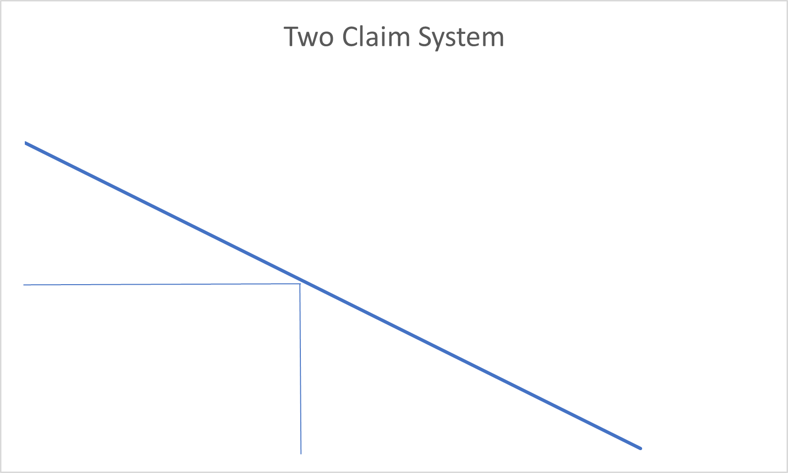
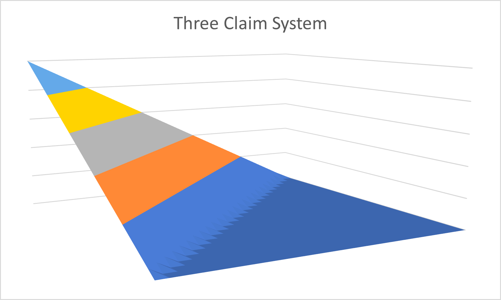

# Homeowners Amount of Insurance Factors

__Circumstances__

It was difficult in my generalized linear model to adequately represent the Homeowners Factors.  I needed a smooth transition from level to level in order to maintain control of my correlated variables like deductible, but my attempts at curve fitting yielded inadequate results.  Because there was sparse data in the lower limits, curve fitting attempts were not providing the business with adequate rates at the lower limits.  

__Derivation__

We begin with the assumptions and derivation of the limit factor model.  Then we will extend it to a system where multiple claims may occur limited by L.  This would be similar to a home struck by multiple weather events in a single year.  

The first step is to consider one claim.  This will behave linearly and will look like the limit factor model:

Not too mysterious, we've seen this before.  If we continue to a two claim system and look at this graphically, we get:

As you can see, the two claim system is limited.  If claim1 is L1, then claim2 is the occurence limit (L) less L1.  The area is:

Let's look at the 3 claim system.  

Now, the three claim system is limited.  If claim1 is L1 and claim2 is L2, then claim3 is the occurence limit (L) less L1 and L2.  The volume is:

There is no way to display a 4 dimensional claim system, but a pattern is starting to emerge.  If we add all outcomes in this series from 1 claim to infinity, we yield the following:

### Amount of Insurance Factor = 

### Deductibles by amount of insurance factors: 
Assuming that the deductible applies, then we are not integrating from zero.  We are integrating from the deductible D to the limit L.  This looks like the following:

Add one and subtract one:

If we pull out the limit portion:

Now when I divide by the base limit/base deductible combination then cut away the AOI factor portion, then we are left with the deductible by amount of insurance factor as follows:

